# matdoc.Configuration: Examples

The configuration of the UML export is generally controlled by the public properties.

The following properties can be set:
 - HideEnumerationMember
 - HideEvents
 - HideInheritance
 - HideMethods
 - HideProperties
 - IgnoreBuiltInClass
 - IngoreBuiltInMethodInheritance
 - IngoreBuiltInPropertyInheritance
 - MethodInheritanceHint
 - PropertyDescription
 - PropertyInheritanceHint
 - SafeUmlExport

There are also some special settings which can be used as a short cut and only in combination with a value of `true`:
 - IngoreBuiltInInheritance
 - InheritanceHint
 - OnlyRelationship

## Default Behaviour

The behavior of each setting, the class diagram of `matdoc.meta.Class` and `matdoc.enums.AccessLevel` is used. Below you'll the output with the default settings:

```matlab
theDoc = matdoc.Documentation({...
   'matdoc.meta.Class',...
   'matdoc.enums.AccessLevel'...
    });
theDoc.UmlToFile('\doc\uml-examples\export-class.txt');
```
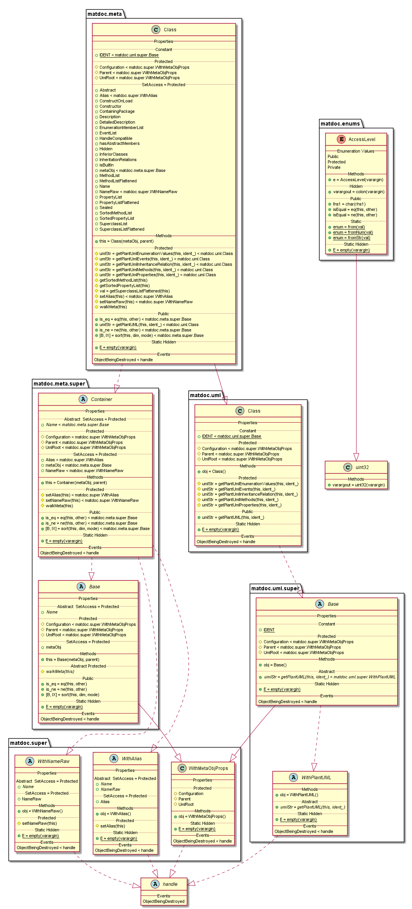

The UML output: **[export-class.txt](uml-examples/export-class.txt)**

## Properties

### HideEnumerationMember

Flag: true or false
 Default: false
 If set the UML won't contain any information about enumeration
 members

*Default: **false***

#### Example

```matlab
theDoc = matdoc.Documentation({...
   'matdoc.meta.Class',...
   'matdoc.enums.AccessLevel'...
    },...
    'HideEnumerationMember', true...
    );
theDoc.UmlToFile('doc\uml-examples\export-class-HideEnumerationMember-true.txt');
```
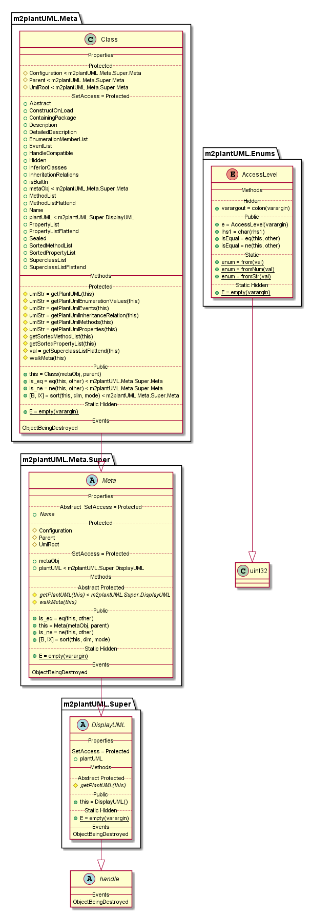

The UML output: **[export-class-HideEnumerationMember-true.txt](uml-examples/export-class-HideEnumerationMember-true.txt)**

### HideEvents

Flag: true or false
 Default: false
 If set the UML won't contain any information about events

*Default: **false***

#### Example

```matlab
theDoc = matdoc.Documentation({...
   'matdoc.meta.Class',...
   'matdoc.enums.AccessLevel'...
    },...
    'HideEvents', true...
    );
theDoc.UmlToFile('doc\uml-examples\export-class-HideEvents-true.txt');
```
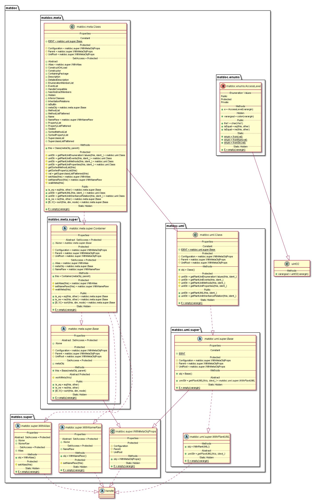

The UML output: **[export-class-HideEvents-true.txt](uml-examples/export-class-HideEvents-true.txt)**

### HideInheritance

Flag: true or false
 Default: false
 If set the UML won't contain any information about inheritances
 If you specify inheritances your self, they will still be
 displayed!

*Default: **false***

#### Example

```matlab
theDoc = matdoc.Documentation({...
   'matdoc.meta.Class',...
   'matdoc.enums.AccessLevel'...
    },...
    'HideInheritance', true...
    );
theDoc.UmlToFile('doc\uml-examples\export-class-HideInheritance-true.txt');
```
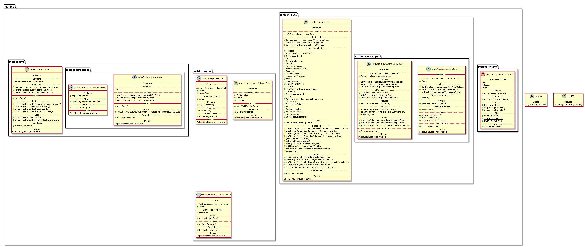

The UML output: **[export-class-HideInheritance-true.txt](uml-examples/export-class-HideInheritance-true.txt)**

### HideMethods

Flag: true or false
 Default: false
 If set the UML won't contain any information about methods

*Default: **false***

#### Example

```matlab
theDoc = matdoc.Documentation({...
   'matdoc.meta.Class',...
   'matdoc.enums.AccessLevel'...
    },...
    'HideMethods', true...
    );
theDoc.UmlToFile('doc\uml-examples\export-class-HideMethods-true.txt');
```
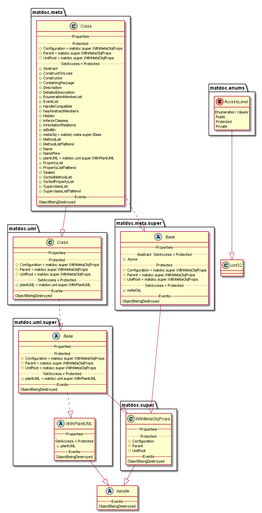

The UML output: **[export-class-HideMethods-true.txt](uml-examples/export-class-HideMethods-true.txt)**

### HideProperties

Flag: true or false
 Default: false
 If set the UML won't contain any information about properties

*Default: **false***

#### Example

```matlab
theDoc = matdoc.Documentation({...
   'matdoc.meta.Class',...
   'matdoc.enums.AccessLevel'...
    },...
    'HideProperties', true...
    );
theDoc.UmlToFile('doc\uml-examples\export-class-HideProperties-true.txt');
```
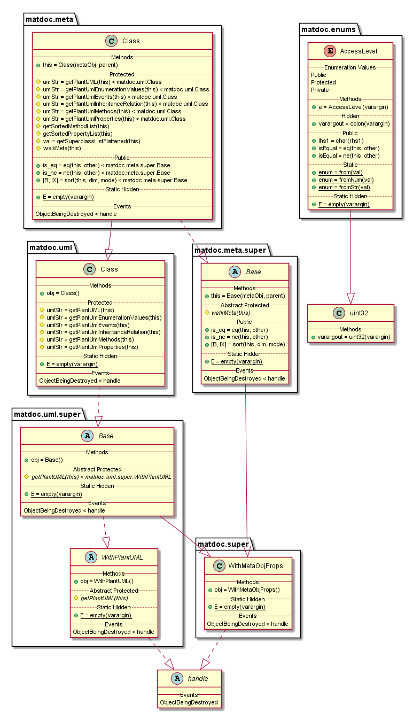

The UML output: **[export-class-HideProperties-true.txt](uml-examples/export-class-HideProperties-true.txt)**

### IgnoreBuiltInClass

Flag: true or false
 Default: false
 If set the uml export will not contain refrences to built-in
 classes

*Default: **false***

#### Example

```matlab
theDoc = matdoc.Documentation({...
   'matdoc.meta.Class',...
   'matdoc.enums.AccessLevel'...
    },...
    'IgnoreBuiltInClass', true...
    );
theDoc.UmlToFile('doc\uml-examples\export-class-IgnoreBuiltInClass-true.txt');
```
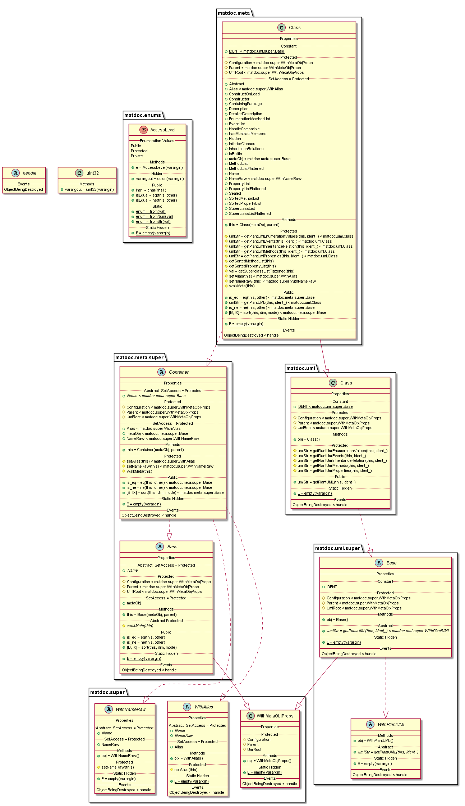

The UML output: **[export-class-IgnoreBuiltInClass-true.txt](uml-examples/export-class-IgnoreBuiltInClass-true.txt)**

### IngoreBuiltInMethodInheritance

Flag: true or false
 Default: true
 If set the uml export will not contain methods inheritated from
 built-in classes

*Default: **true***

#### Example

```matlab
theDoc = matdoc.Documentation({...
   'matdoc.meta.Class',...
   'matdoc.enums.AccessLevel'...
    },...
    'IngoreBuiltInMethodInheritance', false...
    );
theDoc.UmlToFile('doc\uml-examples\export-class-IngoreBuiltInMethodInheritance-false.txt');
```
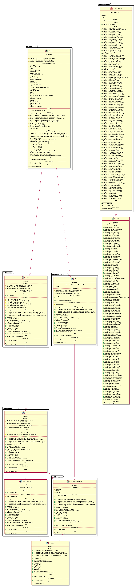

The UML output: **[export-class-IngoreBuiltInMethodInheritance-false.txt](uml-examples/export-class-IngoreBuiltInMethodInheritance-false.txt)**

### IngoreBuiltInPropertyInheritance

Flag: true or false
 Default: true
 If set the uml export will not contain properties inheritated
 from built-in classes

*Default: **true***

#### Example

```matlab
theDoc = matdoc.Documentation({...
   'matdoc.meta.Class',...
   'matdoc.enums.AccessLevel'...
    },...
    'IngoreBuiltInPropertyInheritance', false...
    );
theDoc.UmlToFile('doc\uml-examples\export-class-IngoreBuiltInPropertyInheritance-false.txt');
```
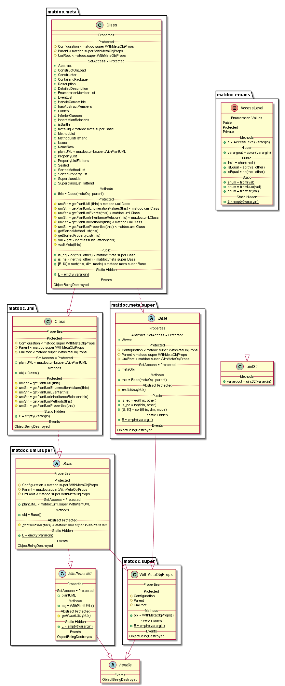

The UML output: **[export-class-IngoreBuiltInPropertyInheritance-false.txt](uml-examples/export-class-IngoreBuiltInPropertyInheritance-false.txt)**

### MethodInheritanceHint

Flag: true or false
 Default: true
 If set the UML will contain information about inhertitated
 methods at the end of the line

*Default: **true***

#### Example

```matlab
theDoc = matdoc.Documentation({...
   'matdoc.meta.Class',...
   'matdoc.enums.AccessLevel'...
    },...
    'MethodInheritanceHint', false...
    );
theDoc.UmlToFile('doc\uml-examples\export-class-MethodInheritanceHint-false.txt');
```
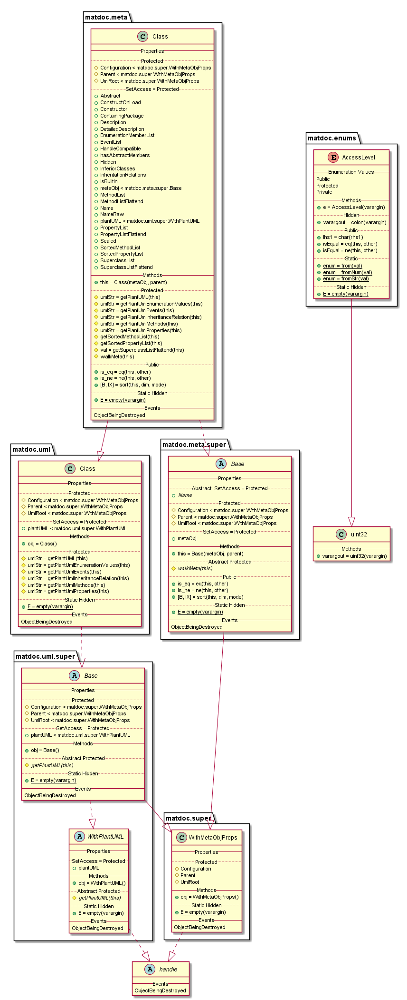

The UML output: **[export-class-MethodInheritanceHint-false.txt](uml-examples/export-class-MethodInheritanceHint-false.txt)**

### PropertyDescription

Flag: true or false
 Default: false
 If set the description of each property will be added to the UML
 diagram

*Default: **false***

#### Example

```matlab
theDoc = matdoc.Documentation({...
   'matdoc.meta.Class',...
   'matdoc.enums.AccessLevel'...
    },...
    'PropertyDescription', true...
    );
theDoc.UmlToFile('doc\uml-examples\export-class-PropertyDescription-true.txt');
```
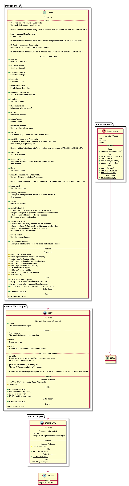

The UML output: **[export-class-PropertyDescription-true.txt](uml-examples/export-class-PropertyDescription-true.txt)**

### PropertyInheritanceHint

Flag: true or false
 Default: true
 If set the UML will contain information about inhertitated
 properties at the end of the line

*Default: **true***

#### Example

```matlab
theDoc = matdoc.Documentation({...
   'matdoc.meta.Class',...
   'matdoc.enums.AccessLevel'...
    },...
    'PropertyInheritanceHint', false...
    );
theDoc.UmlToFile('doc\uml-examples\export-class-PropertyInheritanceHint-false.txt');
```
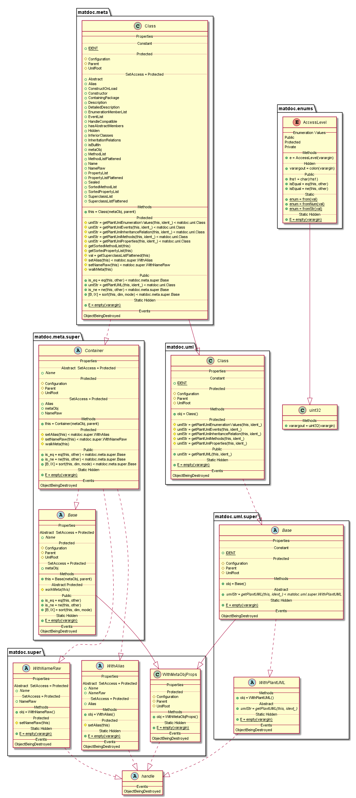

The UML output: **[export-class-PropertyInheritanceHint-false.txt](uml-examples/export-class-PropertyInheritanceHint-false.txt)**

### SafeUmlExport

Flag: true or fals
 Default: false
 If set the UML export will be done class wise instead of nesting
 classes into their packages. This can address issues when the
 classe diagram looks funky or classes are actually completly
 missing form diagram. This is mainly caused by naming conflicts
 when classes and packages have the same name.

*Default: **false***

#### Example

```matlab
theDoc = matdoc.Documentation({...
   'matdoc.meta.Class',...
   'matdoc.enums.AccessLevel'...
    },...
    'SafeUmlExport', true...
    );
theDoc.UmlToFile('doc\uml-examples\export-class-SafeUmlExport-true.txt');
```
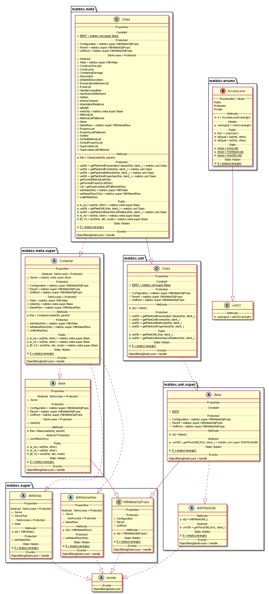

The UML output: **[export-class-SafeUmlExport-true.txt](uml-examples/export-class-SafeUmlExport-true.txt)**

## Special Settings

### IngoreBuiltInInheritance

IngoreBuiltInMethodInheritance and IngoreBuiltInPropertyInheritance combined.

#### Example

```matlab
theDoc = matdoc.Documentation({...
   'matdoc.meta.Class',...
   'matdoc.enums.AccessLevel'...
    },...
    'IngoreBuiltInInheritance', true...
    );
theDoc.UmlToFile('doc\uml-examples\export-class-IngoreBuiltInInheritance-true.txt');
```
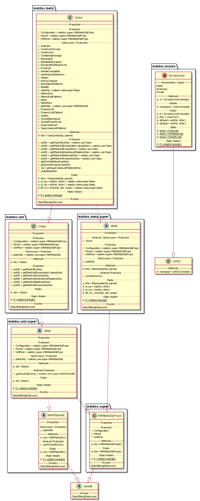

The UML output: **[export-class-IngoreBuiltInInheritance-true.txt](uml-examples/export-class-IngoreBuiltInInheritance-true.txt)**

### InheritanceHint

MethodInheritanceHint and PropertyInheritanceHint combined.

#### Example

```matlab
theDoc = matdoc.Documentation({...
   'matdoc.meta.Class',...
   'matdoc.enums.AccessLevel'...
    },...
    'InheritanceHint', true...
    );
theDoc.UmlToFile('doc\uml-examples\export-class-InheritanceHint-true.txt');
```


The UML output: **[export-class-InheritanceHint-true.txt](uml-examples/export-class-InheritanceHint-true.txt)**

### OnlyRelationship

Hiddes all methods, properties, events and enumeration members to let the user focus on the relation between the classes. This can be helfull when the Diagram is very large or fairly complicated.

#### Example

```matlab
theDoc = matdoc.Documentation({...
   'matdoc.meta.Class',...
   'matdoc.enums.AccessLevel'...
    },...
    'OnlyRelationship', true...
    );
theDoc.UmlToFile('doc\uml-examples\export-class-OnlyRelationship-true.txt');
```
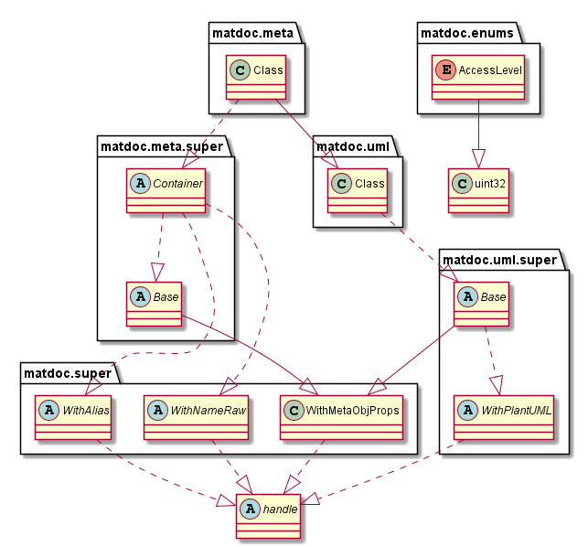

The UML output: **[export-class-OnlyRelationship-true.txt](uml-examples/export-class-OnlyRelationship-true.txt)**